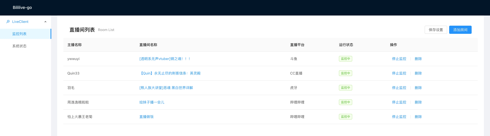

# Bililive-go
[](https://github.com/hr3lxphr6j/bililive-go/actions/workflows/tests.yaml)
[](https://goreportcard.com/report/github.com/hr3lxphr6j/bililive-go)
[](https://github.com/hr3lxphr6j/bililive-go/releases/latest)
[](https://hub.docker.com/r/chigusa/bililive-go/)
[](https://space.bilibili.com/18578203/)

Bililive-go是一个支持多种直播平台的直播录制工具   



## 支持网站

<table>
    <tr align="center">
        <th>站点</th>
        <th>url</th>
        <th>支持情况</th>
        <th>cookie</th>
    </tr>
    <tr align="center">
        <td>Acfun直播</td>
        <td>live.acfun.cn</td>
        <td>滋瓷</td>
        <td></td>
    </tr>
    <tr align="center">
        <td>哔哩哔哩直播</td>
        <td>live.bilibili.com</td>
        <td>滋瓷</td>
        <td>滋瓷</td>
    </tr>
    <tr align="center">
        <td>战旗直播</td>
        <td>www.zhanqi.tv</td>
        <td>滋瓷</td>
        <td></td>
    </tr>
    <tr align="center">
        <td>斗鱼直播</td>
        <td>www.douyu.com</td>
        <td>滋瓷</td>
        <td></td>
    </tr>
    <tr align="center">
        <td>火猫直播</td>
        <td>www.huomao.com</td>
        <td>滋瓷</td>
        <td></td>
    </tr>
    <tr align="center">
        <td>龙珠直播</td>
        <td>longzhu.com</td>
        <td>滋瓷</td>
        <td></td>
    </tr>
    <tr align="center">
        <td>虎牙直播</td>
        <td>www.huya.com</td>
        <td>滋瓷</td>
        <td></td>
    </tr>
    <tr align="center">
        <td>CC直播</td>
        <td>cc.163.com</td>
        <td>滋瓷</td>
        <td></td>
    </tr>
    <tr align="center">
        <td>一直播</td>
        <td>www.yizhibo.com</td>
        <td>滋瓷</td>
        <td></td>
    </tr>
    <tr align="center">
        <td>OPENREC</td>
        <td>www.openrec.tv</td>
        <td>滋瓷</td>
        <td></td>
    </tr>
    <tr align="center">
        <td>企鹅电竞</td>
        <td>egame.qq.com</td>
        <td>滋瓷</td>
        <td></td>
    </tr>
    <tr align="center">
        <td>浪live</td>
        <td>play.lang.live & www.lang.live</td>
        <td>滋瓷</td>
        <td></td>
    </tr>
    <tr align="center">
        <td>花椒</td>
        <td>www.huajiao.com</td>
        <td>滋瓷</td>
        <td></td>
    </tr>
    <tr align="center">
        <td>抖音直播</td>
        <td>live.douyin.com</td>
        <td>滋瓷</td>
        <td>滋瓷</td>
    </tr>
    <tr align="center">
        <td>猫耳</td>
        <td>fm.missevan.com</td>
        <td>滋瓷</td>
        <td></td>
    </tr>
    <tr align="center">
        <td>克拉克拉</td>
        <td>www.hongdoufm.com</td>
        <td>滋瓷</td>
        <td></td>
    </tr>
    <tr align="center">
        <td>YY直播</td>
        <td>www.yy.com</td>
        <td>滋瓷</td>
        <td></td>
    </tr>
    <tr align="center">
        <td>微博直播</td>
        <td>weibo.com</td>
        <td>滋瓷</td>
        <td></td>
    </tr>
</table>

### cookie 在 config.yml 中的设置方法

cookie的设置以域名为单位。比如想在录制抖音直播时使用 cookie，那么 `config.yml` 中可以像下面这样写：
```
cookies:
  live.douyin.com: __ac_nonce=123456789012345678903;name=value
```
这里 name 和 value 只是随便举的例子，用来说明当添加超过一条 cookie 的键值对时应该用分号隔开。
至于具体应该添加哪些键，就需要用户针对不同网站自己获取了。

## 在网页中修改设置

点击网页左边的 `设置` 可以在线修改项目的配置文件，之后点击页面下面的 `保存设置` 按钮保存设置。
如果保存后窗口提醒设置保存成功，那就是配置文件已经被写入磁盘了。如果是保存失败，那可能是配置文件格式问题或者遇到程序 bug，总之磁盘上的配置文件没变。

在网页中即使保存配置成功也不一定表示相应的配置会立即生效。
有些配置需要停止监控后再重新开始监控才会生效，有些配置也许要重启程序才会生效。

## 网页播放器

点击对应直播间行右边的 `文件` 链接可以跳转到对应直播间的录播目录中。  
当然你点左边的 `文件` 一路找过去也行。

https://github.com/hr3lxphr6j/bililive-go/assets/2352900/6453900c-6321-417b-94f2-d65ec2ab3d7e

## Grafana 面板

docker compose 用户可以取消项目根目录下 `docker-compose.yml` 文件中 prometheus 和 grafana 部分的注释以启用统计面板。  
这里是 [设置说明](docs/grafana.md)

非 docker compose 用户需要自行部署 prometheus 和 grafana。  
这里是 [一些建议](docs/grafana.md#%E6%89%8B%E5%8A%A8%E5%AE%89%E8%A3%85%E7%AC%94%E8%AE%B0)


## 依赖
* [ffmpeg](https://ffmpeg.org/)

## 安装和使用

### Windows
https://github.com/hr3lxphr6j/bililive-go/wiki/Install-Windows

### macOS
https://github.com/hr3lxphr6j/bililive-go/wiki/Install-macOS

### Linux
https://github.com/hr3lxphr6j/bililive-go/wiki/Install-Linux

### docker

使用 https://hub.docker.com/r/chigusa/bililive-go 镜像创建容器运行。

例如：
```
docker run --restart=always -v ~/config.yml:/etc/bililive-go/config.yml -v ~/Videos:/srv/bililive -p 8080:8080 -d chigusa/bililive-go
```

### docker compose

使用项目根目录下的 `docker-compose.yml` 配置文件启动 docker compose 运行。

例如：
```
docker compose up
```
此时默认使用 `config.docker.yml` 文件作为程序的配置文件，`Videos/` 目录作为录制视频的输出目录。

NAS 用户使用系统自带 GUI 创建 docker compose 的情况请参考群晖用 docker compose 安装 bgo 的 [图文说明](./docs/Synology-related.md#如何用-docker-compose-安装-bgo)

## 常见问题
[docs/FAQ.md](docs/FAQ.md)

## 开发环境搭建（linux系统）
```
一、环境准备
  1. 前端环境
    1）前往https://nodejs.org/zh-cn/下载当前版本node（18.12.1）
    2）命令行运行 node -v 若控制台输出版本号则前端环境搭建成功
  2.后端环境
    1)下载golang安装 版本号1.19
      国际: https://golang.org/dl/
      国内: https://golang.google.cn/dl/
    2)命令行运行 go 若控制台输出各类提示命令 则安装成功 输入 go version 确认版本
  3.安装 ffmpeg (以centos7为例)
    1) yum install -y epel-release rpm
    2) rpm --import /etc/pki/rpm-gpg/RPM-GPG-KEY-EPEL-7
    3) yum repolist
    4) rpm --import http://li.nux.ro/download/nux/RPM-GPG-KEY-nux.ro
    5) rpm -Uvh http://li.nux.ro/download/nux/dextop/el7/x86_64/nux-dextop-release-0-1.el7.nux.noarch.rpm
    6) yum repolist
    7) yum install -y ffmpeg
二、克隆代码并编译(linux环境)    
   1. git clone https://github.com/hr3lxphr6j/bililive-go.git
   2. cd bililive-go
   3. make build-web
   4. make 
三、linux编译其他环境(以windows 为例)
   1. GOOS=windows GOARCH=amd64 CGO_ENABLED=0 UPX_ENABLE=0 TAGS=dev GCFLAGS="all=-N -l" ./src/hack/build.sh bililive
   2.如果不需要调试，可以改成
      GOOS=windows GOARCH=amd64 CGO_ENABLED=0 UPX_ENABLE=0 TAGS=release ./src/hack/build.sh bililive
```

## Wiki
[Wiki](https://github.com/hr3lxphr6j/bililive-go/wiki)

## API
[API doc](https://github.com/hr3lxphr6j/bililive-go/blob/master/docs/API.md)

## 参考
- [you-get](https://github.com/soimort/you-get)
- [ykdl](https://github.com/zhangn1985/ykdl)
- [youtube-dl](https://github.com/ytdl-org/youtube-dl)
