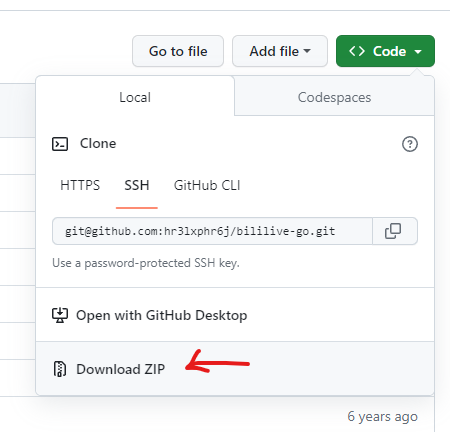
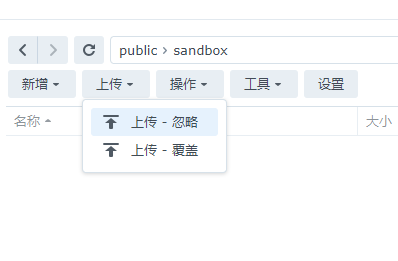
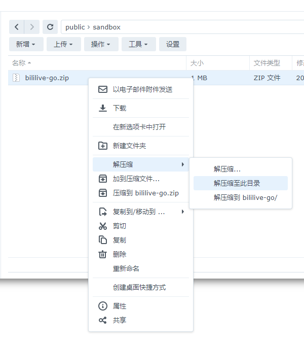
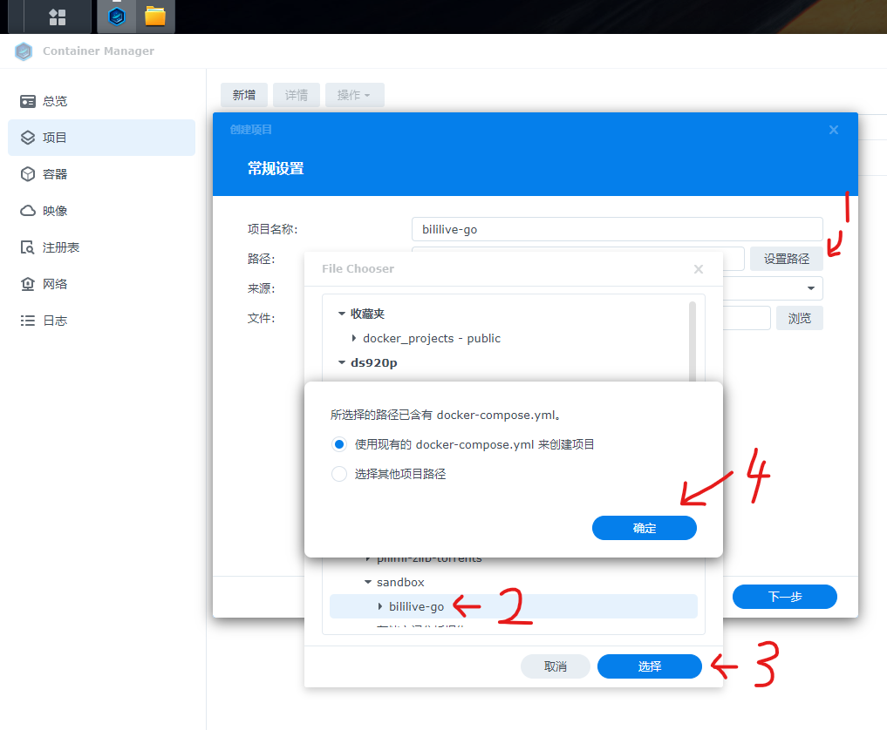
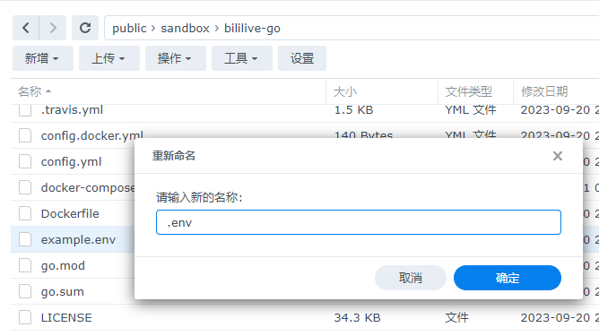
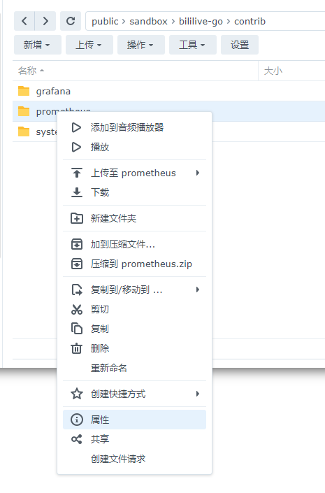
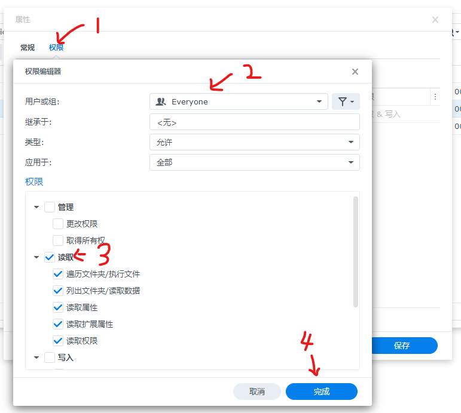
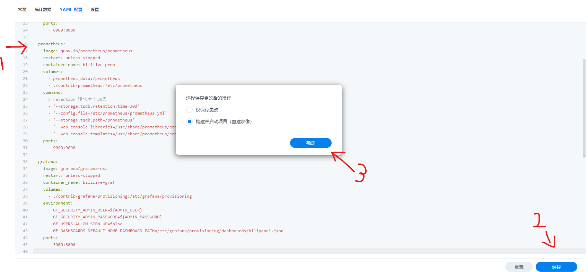

# 群晖 (Synology) 相关信息汇总

## 如何用 docker compose 安装 bgo

1. 下载项目代码的 zip 压缩包到本地

2. 上传到NAS

3. 解压代码

4. 从 Container Manager 的 `项目` 中创建 bgo 的 docker compose 项目

5. 后面一路 下一步，直到完成。

完成后默认在 NAS 的 8080 端口访问 bgo

### 启用 grafana 统计面板

1. 将 `example.env` 文件重命名为 `.env`

2. 为 `contrib/grafana` 和 `contrib/prometheus` 目录添加可读权限 （因为他们的docker镜像中的用户权限比较复杂= =）

这里仅以修改 prometheus 目录的访问权限为例。

右键文件夹点属性

为文件夹添加所有人可以访问的权限

后面一路完成保存

3. 修改 yaml 配置

删除 `docker-compose.yml` 文件中 prometheus 和 grafana 部分的`#`字符以启用统计面板。

如果已经按照上面的步骤创建了项目并且项目正在运行中，那么需要先停止项目后，才能修改 yaml 配置。修改后保存配置并重新构建和启动项目。

如果还没有创建项目，那现在可以按照上面 [如何用 docker compose 安装 bgo](#如何用-docker-compose-安装-bgo) 的步骤创建项目啦~